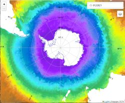
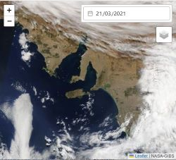

# Leafdoc-generated API reference

## L

A calendar plugin for leaflet maps. The plugin allows you to browse through remote sensing datasets that vary over time. You add a datepicker to your <a href="https://leafletjs.com/">Leaflet</a> web-map to give end-user control over the date of the data displayed.

There are two main elements needed:

1:- the date picker, to select the date and

2:- extensions to the leaflet layers types so that information is updated when the date is changed.

Click the images for examples:

]

This plugin uses the <a href="https://vue3datepicker.com/">Vue Datepicker</a>, but you do not need to be using Vue. It is standalone.

### Usage example

Simple install:

<pre><code class="language-js">add to your html file
&lt;script src=&quot;https://unpkg.com/leaflet-datepicker/dist/leaflet-datepicker.umd.cjs&quot; integrity=&quot;...&quot; crossorigin=&quot;&quot;&gt;&lt;/script&gt;
&lt;script src=&quot;https://unpkg.com/leaflet-datepicker/dist/style.css&quot; integrity=&quot;...&quot; crossorigin=&quot;&quot;&gt;&lt;/script&gt;
</code></pre>

(Best practice is to include integrity keys, e.g. from https://www.srihash.org)

if you are using npm, install leaflet-datepicker

<pre><code class="language-js">import 'leaflet-datepicker'
import '../node_modules/leaflet-calendar/dist/style.css'
</code></pre>

if you are using vite, also install @vitejs/plugin-vue (as dev dependency). Add the vue plugin in vite.config.js:

<pre><code class="language-js">import vue from '@vitejs/plugin-vue'
export default defineConfig({
 plugins: [vue()],
 ... //the rest of your config
</code></pre>

## L.Control.Datepicker

Inherits L.Control

This creates a leaflet 'control' with a datepicker inside it. The datepicker can be daily, monthly or annual. This changes the value of map.date, when the calendar is changes, and also emits the date used a &quot;dayChanged&quot;, &quot;monthChanged&quot; and or &quot;yearChanged&quot; event.

The frequency of the datepicker is set by the 'freq' option for each layer added to the map. The highest frequency 'freq' option set for layers added to the map is used as the date picker. e.g:

<ul>
<li>If no layers have the 'freq' option, then the datepicker does not show (but there is an empty space in allocated for it)</li>
<li>If one layer has the freq option set as 'yearly', then a calendar with years only is shown</li>
<li>If one layer has the 'monthly' option, and one has the 'yearly' option, then the monthly calendar is shown</li>
<li>If one layer has the 'daily' option set, and two layers have 'monthly', and three have 'yearly', the daily calendar is shown.</li>
</ul>

The date is stored as a date object in map.date. The datepicker can by styled using the 'date-control' css element, and the #datepicker css id.

The datepicker is used with the TimeLocal extensions to Leaflet layers.

### Usage example

<pre><code class="language-js">
map.date=new Date() ;

L.control.datepicker().addTo(map) ;

</code></pre>

There are lots of options in the vue-datepicker which are not-supported by the plugin (but it would be easy enough to add them). For example there is no support of date-ranges, time of day, multi-calendars etc

### Options

<table><thead>
	<tr>
		<th>Option</th>
		<th>Type</th>
		<th>Default</th>
		<th>Description</th>
	</tr>
	</thead><tbody>
	<tr id='l-control-datepicker-position'>
		<td><code><b>position</b></code></td>
		<td><code>String</code>
		<td><code>&#x27;topright&#x27;</code></td>
		<td>'topright'|'topleft'|'bottomleft'|'bottomright'

which corner to show the datepicker on the map.
</td>
	</tr>
	<tr id='l-control-datepicker-frequency'>
		<td><code><b>frequency</b></code></td>
		<td><code>String</code>
		<td><code>&#x27;monthly&#x27;</code></td>
		<td>'daily'|'monthly'|'yearly'|'none'

which frequency to start the datepicker on. This is changed later by the freq option for each layer added.
</td>
	</tr>
	<tr id='l-control-datepicker-mindate'>
		<td><code><b>minDate</b></code></td>
		<td><code>[String|Date object]</code>
		<td><code>&#x27;1980&#x27;</code></td>
		<td>the first date you can pick in the datepicker, default 1980</td>
	</tr>
	<tr id='l-control-datepicker-maxdate'>
		<td><code><b>maxDate</b></code></td>
		<td><code>[String|Date object]</code>
		<td><code>yesterday</code></td>
		<td>the last date you can pick in the datepicker,</td>
	</tr>
</tbody></table>

## Time Local

These are the layers types which are supported and then change when the date on the map is change.

First create map.date and add the datepicker control, then you can add these layers to your javascript.

Layers from local files have urls formed with a url template, using keywords surrounded by {}.

The allowed keywords are :

<ul>
<li>{year}: four digit year (e.g. would be replace with 2022 if this is the year selected in the calendar)</li>
<li>{month}: 1/2 digit month as a number (e.g. would shown 1 for Jan, and 10 for October)</li>
<li>{day}: 1/2 digit day as a number (e.g. would show 1 for the 1st and 30 for the 30th)</li>
<li>{dateStr}: returned from this.options.dateStr(obj) function. Where obj contains a date object and a day,month and year strings.
e.g.
<code>dateStr:(obj) =&gt; { return obj.date.toISOString()} </code>
would let us use a {dateStr} template var in the url,  which in turn would return the data in <code>2023-04-20T04:30:06.608Z</code> format</li>
</ul>

Look at the examples for each layer type below.

## GeoJSON.TimeLocal

aka L.GeoJSON.TimeLocal

inherits L.GeoJSON.FromURL

Load a GeoJSONs file from local storage or a url template, with one file per timestep.

<pre><code class="language-js">//Constructor function:
L.geoJSON.timeLocal(
	startDate,
	urlTemplate,
	options
)
</code></pre>

### Usage example

<pre><code class="language-js">L.geoJSON.timeLocal(
	date,
	&quot;data/duration/duration_{year}.json&quot;,
	{
		freq: 'yearly',
	}
).addTo(map)
</code></pre>

which would show <code>data/duration/duration_2022.json</code> on the map if 2022 was the year selected in the calendar

### Options

<table><thead>
	<tr>
		<th>Option</th>
		<th>Type</th>
		<th>Default</th>
		<th>Description</th>
	</tr>
	</thead><tbody>
	<tr id='geojson-timelocal-freq'>
		<td><code><b>freq</b></code></td>
		<td><code>String</code>
		<td><code>&#x27;daily&#x27;</code></td>
		<td>Frequency of steps between data in this data set. Options are 'daily','monthly','yearly'</td>
	</tr>
	<tr id='geojson-timelocal-datestr'>
		<td><code><b>dateStr</b></code></td>
		<td><code>Function(obj)</code>
		<td><code>None</code></td>
		<td>use this to create a custom dateStr var in the urlTemplate</td>
	</tr>
</tbody></table>

## ImageOverlay.TimeLocal

inherits L.ImageOverlay

Load an  image from local storage based on the specified date.

<pre><code class="language-js">//Constructor function:
L.imageOverlay.timeLocal(
	startDate,
	urlTemplate,
	bounds,
	options
)
</code></pre>

### Usage example

<pre><code class="language-js">
L.imageOverlay.timeLocal(
	map.date,
	&quot;tracker_data/chlor_conc_anoms/occci_chlor_conc_anoms_{year}_{month}.png&quot;, 
	[[-39.23, -42.24],[-41.45, 135.0]],
	{
		freq: 'monthly',
		alt: 'No data for Chlorophyll Conc for this month'
	}
) 
</code></pre>

Bounds is unchanged from L.ImageOverlay

### Options

<table><thead>
	<tr>
		<th>Option</th>
		<th>Type</th>
		<th>Default</th>
		<th>Description</th>
	</tr>
	</thead><tbody>
	<tr id='imageoverlay-timelocal-freq'>
		<td><code><b>freq</b></code></td>
		<td><code>String</code>
		<td><code>&#x27;daily&#x27;</code></td>
		<td>Frequency of steps between data in this data set. Options are 'daily','monthly','yearly'</td>
	</tr>
	<tr id='imageoverlay-timelocal-datestr'>
		<td><code><b>dateStr</b></code></td>
		<td><code>Function(obj)</code>
		<td><code>None</code></td>
		<td>function to create a custom dateStr var to use in the url template.</td>
	</tr>
</tbody></table>

## TileLayer.Time

inherits L.TileLayer

Used to load a single image from web (TMS server) based on the specified time. Url must include <code>{time}</code>.

Other options are inherited from L.TileLayer

### Usage example

<pre><code class="language-js">L.tileLayer.time(
	&quot;https://gibs.earthdata.nasa.gov/wmts/epsg3031/best/{layer}/default/{time}/{tileMatrixSet}/{z}/{y}/{x}.png&quot;, 
	{
		layer: &quot;AMSRU2_Sea_Ice_Concentration_12km&quot;,
		tileMatrixSet: &quot;1km&quot;,
		tileSize: 256,
		format: &quot;image/png&quot;,
		transparent: true,
		freq:'daily',
		attribution: &quot;&lt;a href='https://seaice.uni-bremen.de/sea-ice-concentration/amsre-amsr2/'&gt;AMSR2&lt;/a&gt;&quot;,
	}
)
</code></pre>

### Options

<table><thead>
	<tr>
		<th>Option</th>
		<th>Type</th>
		<th>Default</th>
		<th>Description</th>
	</tr>
	</thead><tbody>
	<tr id='tilelayer-time-freq'>
		<td><code><b>freq</b></code></td>
		<td><code>String</code>
		<td><code>&#x27;daily&#x27;</code></td>
		<td>Frequency of steps between data in this data set. Options are 'daily','monthly','yearly'</td>
	</tr>
	<tr id='tilelayer-time-datestr'>
		<td><code><b>dateStr</b></code></td>
		<td><code>Function(date)</code>
		<td><code>returns YY-MM-DD</code></td>
		<td>you might need to tweak it to suit the format required by the server</td>
	</tr>
</tbody></table>

## TileLayer.WMS.Time

Inherits L.TileLayer

Used to load a WMS from web based on the specified time. Url must include <code>{dateStr}</code>

### Usage example

<pre><code class="language-js">L.tileLayer.wms.time(
       &quot;https://my.cmems-du.eu/thredds/wms/METOFFICE-GLO-SST-L4-REP-OBS-SST&quot;,
       {
           layers: &quot;analysed_sst&quot;, 
           styles: &quot;boxfill/occam&quot; ,
           format: &quot;image/png&quot;,
           transparent: &quot;true&quot;,
           freq: &quot;monthly&quot;,
           attribution: &quot;OSTIA&quot;,
           tileSize: 256,
           dateStr: (date) =&gt; {
               return `${date.getFullYear()}-${String(date.getMonth()+1).padStart(2,0)}-15T12:00:00.000Z` ; //custom date format
           }, 
           bounds: [[15, -180],[-80, 180]],
       }
   ),
</code></pre>

### Options

<table><thead>
	<tr>
		<th>Option</th>
		<th>Type</th>
		<th>Default</th>
		<th>Description</th>
	</tr>
	</thead><tbody>
	<tr id='tilelayer-wms-time-freq'>
		<td><code><b>freq</b></code></td>
		<td><code>String</code>
		<td><code>&#x27;daily&#x27;</code></td>
		<td>Frequency of steps between data in this data set. Options are 'daily','monthly','yearly'</td>
	</tr>
	<tr id='tilelayer-wms-time-datestr'>
		<td><code><b>dateStr</b></code></td>
		<td><code>Function(date)</code>
		<td><code>returns YYYY-MM-DDTHH:mm:ss.sssZ</code></td>
		<td>default date format is Zulu time, as this is more common for WMS servers</td>
	</tr>
</tbody></table>

