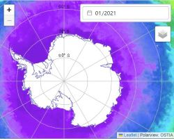

# Leafdoc-generated API reference

## L

A calendar plugin for leaflet maps, using the Vue Datepicker

&lt;a href=https://anton-seaice.github.io/Leaflet.Datepicker/examples/antarctic.html alt='Antarctic Example' target=_blank&gt;&lt;img src=./examples/antarcticScreenshot.PNG width=40%&gt;&lt;/a&gt;
&lt;a href=https://anton-seaice.github.io/Leaflet.Datepicker/examples/simple.html alt='Simple Example' target=_blank&gt;&lt;img src=./examples/antarcticScreenshot.PNG width=40%&gt;&lt;/a&gt;

#To-do

an example with Geojson points - i.e. if you have a calendar, could you show what events are on in your city on that day?

## L.Control.Datepicker

Inherits L.Control

This creates a leaflet 'control' with a datepicker inside it. The datepicker is an app made usign the Vue framework, and can be daily, monthly or annual.

The frequency of the datepicker is set by the 'freq' option for each layer added to the map. The highest frequency 'freq' option set for layer added to the map is used as the date picker. e.g:

<ul>
<li>If no layers have the 'freq' option, then the datepicker does not show (but there is an empty space in allocated for it)</li>
<li>If one layer has the freq option set as 'yearly', then a calendar with years only is shown</li>
<li>If one layer has the 'monthly' option, and one has the 'yearly' option, then the monthly calendar is shown</li>
<li>If one layer has the 'daily' option set, and two layers have 'monthly', and three have 'yearly', the daily calendar is shown.</li>
</ul>

The date is stored as a date object in map.date

The datepicker is used with the TimeLocal extensions to Leaflet layers

### Usage example

<pre><code class="language-js">
map.date=new Date() ;

L.control.datepicker().addTo(map) ;

L.tileLayer.time(
	 &quot;https://gibs.earthdata.nasa.gov/wmts/epsg3031/best/{layer}/default/{time}/{tileMatrixSet}/{z}/{y}/{x}.png&quot;, 
		{
			layer: &quot;AMSRU2_Sea_Ice_Concentration_12km&quot;,
			tileMatrixSet: &quot;1km&quot;,
			format: &quot;image/png&quot;,
			transparent: true,
			freq:'daily',
			attribution: &quot;&lt;a href='https://seaice.uni-bremen.de/sea-ice-concentration/amsre-amsr2/'&gt;AMSR2&lt;/a&gt;&quot;,
		}
).addTo(map) ;

</code></pre>

### Options

<table><thead>
	<tr>
		<th>Option</th>
		<th>Type</th>
		<th>Default</th>
		<th>Description</th>
	</tr>
	</thead><tbody>
	<tr id='l-control-datepicker-position'>
		<td><code><b>position</b></code></td>
		<td><code>String</code>
		<td><code>&#x27;topright&#x27;|&#x27;topleft&#x27;|&#x27;bottomleft&#x27;|&#x27;bottomright&#x27;</code></td>
		<td>which corner to show the datepicker on the map</td>
	</tr>
	<tr id='l-control-datepicker-frequency'>
		<td><code><b>frequency</b></code></td>
		<td><code>String</code>
		<td><code>&#x27;daily&#x27;|&#x27;monthly&#x27;|&#x27;yearly&#x27;|&#x27;none&#x27;</code></td>
		<td>which frequency to start the datepicker on. This is changed later by the freq option for each layer added.</td>
	</tr>
	<tr id='l-control-datepicker-mindate'>
		<td><code><b>minDate</b></code></td>
		<td><code>[String|Date object]</code>
		<td><code>valid date string or date object</code></td>
		<td>the first date you can pick in the datepicker, default 1980</td>
	</tr>
	<tr id='l-control-datepicker-maxdate'>
		<td><code><b>maxDate</b></code></td>
		<td><code>[String|Date object]</code>
		<td><code>valid date string or date object</code></td>
		<td>the last date you can pick in the datepicker, defaults to yesterday</td>
	</tr>
</tbody></table>

## Time Local

These are the supported layers types.

Once you have created map.date and added the datepicker control, you can add these layers.

## GeoJSON.TimeLocal

aka L.GeoJSON.TimeLocal
inherits L.GeoJSON.Local

Load a single GeoJSON file from local storage, with one file per timestep.

### Usage example

<pre><code class="language-js">L.geoJSON.timeLocal(
	date,
	&quot;tracker_data/duration/duration_&quot;,
	'.json',
	{
		freq: 'yearly',
		attribution: &quot;Derived from NSIDC CDR&quot;,
	}
)
</code></pre>

time,fileBasePath and fileExtension are used by 'mixin' TimeLocal

### Options

<table><thead>
	<tr>
		<th>Option</th>
		<th>Type</th>
		<th>Default</th>
		<th>Description</th>
	</tr>
	</thead><tbody>
	<tr id='geojson-timelocal-freq'>
		<td><code><b>freq</b></code></td>
		<td><code>String</code>
		<td><code>&#x27;daily&#x27;</code></td>
		<td>Frequency of steps between data in this data set. Options are 'daily','monthly','yearly'</td>
	</tr>
	<tr id='geojson-timelocal-dateformat'>
		<td><code><b>dateFormat</b></code></td>
		<td><code>Function(date)</code>
		<td><code>returns YYYY-M-D</code></td>
		<td>you might need to tweak it to suit the format required by the server</td>
	</tr>
</tbody></table>

## ImageOverlay.TimeLocal

Inherits ImageOverlay

Used to load a single image from local storage based on the specified time

### Usage example

<pre><code class="language-js">
L.imageOverlay.timeLocal(
	map.date,
	&quot;tracker_data/chlor_conc_anoms/occci_chlor_conc_anoms_&quot;, 
	&quot;.png&quot;, 
	minus40Bounds,
	{
		attribution: Ocean Colour - CCI&quot;,
		freq: 'monthly',
		alt: 'No data for Chlorophyll Conc for this month'
	}
) 
</code></pre>

time,fileBasePath and fileExtension are used by 'mixin' TimeLocal

Bounds is unchanged from L.ImageOverlay

### Options

<table><thead>
	<tr>
		<th>Option</th>
		<th>Type</th>
		<th>Default</th>
		<th>Description</th>
	</tr>
	</thead><tbody>
	<tr id='imageoverlay-timelocal-freq'>
		<td><code><b>freq</b></code></td>
		<td><code>String</code>
		<td><code>&#x27;daily&#x27;</code></td>
		<td>Frequency of steps between data in this data set. Options are 'daily','monthly','yearly'</td>
	</tr>
	<tr id='imageoverlay-timelocal-datestr'>
		<td><code><b>dateStr</b></code></td>
		<td><code>Function(date)</code>
		<td><code>returns YYYY-M-D</code></td>
		<td>you might need to tweak it to suit the format required</td>
	</tr>
</tbody></table>

## TileLayer.Time

Inherits L.TileLayer

Used to load a single image from web (TMS server) based on the specified time. Url must include <code>{time}</code>.

Other options are inherited from L.TileLayer

### Usage example

<pre><code class="language-js">L.tileLayer.time(
	&quot;https://gibs.earthdata.nasa.gov/wmts/epsg3031/best/{layer}/default/{time}/{tileMatrixSet}/{z}/{y}/{x}.png&quot;, 
	{
		layer: &quot;AMSRU2_Sea_Ice_Concentration_12km&quot;,
		tileMatrixSet: &quot;1km&quot;,
		tileSize: 256,
		format: &quot;image/png&quot;,
		transparent: true,
		freq:'daily',
		attribution: &quot;&lt;a href='https://seaice.uni-bremen.de/sea-ice-concentration/amsre-amsr2/'&gt;AMSR2&lt;/a&gt;&quot;,
	}
)
</code></pre>

### Options

<table><thead>
	<tr>
		<th>Option</th>
		<th>Type</th>
		<th>Default</th>
		<th>Description</th>
	</tr>
	</thead><tbody>
	<tr id='tilelayer-time-freq'>
		<td><code><b>freq</b></code></td>
		<td><code>String</code>
		<td><code>&#x27;daily&#x27;</code></td>
		<td>Frequency of steps between data in this data set. Options are 'daily','monthly','yearly'</td>
	</tr>
	<tr id='tilelayer-time-datestr'>
		<td><code><b>dateStr</b></code></td>
		<td><code>Function(date)</code>
		<td><code>returns YY-MM-DD</code></td>
		<td>you might need to tweak it to suit the format required by the server</td>
	</tr>
</tbody></table>

## TileLayer.WMS.Time

Inherits L.TileLayer

Used to load a WMS from web based on the specified time. Url must include <code>{time}</code>

### Usage example

<pre><code class="language-js">L.tileLayer.wms.time(
	&quot;https://gibs.earthdata.nasa.gov/wmts/epsg3031/best/{layer}/default/{time}/{tileMatrixSet}/{z}/{y}/{x}.png&quot;, 
	{
		layer: &quot;AMSRU2_Sea_Ice_Concentration_12km&quot;,
		tileMatrixSet: &quot;1km&quot;,
		tileSize: 256, 
		format: &quot;image/png&quot;,
		transparent: true,
		freq:'daily',
		attribution: &quot;AMSR2&quot;,
	}
)
</code></pre>

### Options

<table><thead>
	<tr>
		<th>Option</th>
		<th>Type</th>
		<th>Default</th>
		<th>Description</th>
	</tr>
	</thead><tbody>
	<tr id='tilelayer-wms-time-freq'>
		<td><code><b>freq</b></code></td>
		<td><code>String</code>
		<td><code>&#x27;daily&#x27;</code></td>
		<td>Frequency of steps between data in this data set. Options are 'daily','monthly','yearly'</td>
	</tr>
	<tr id='tilelayer-wms-time-datestr'>
		<td><code><b>dateStr</b></code></td>
		<td><code>Function(date)</code>
		<td><code>returns YYYY-MM-DDTHH:mm:ss.sssZ</code></td>
		<td>default date format is Zulu time, as this is more common for WMS servers than our default</td>
	</tr>
</tbody></table>

